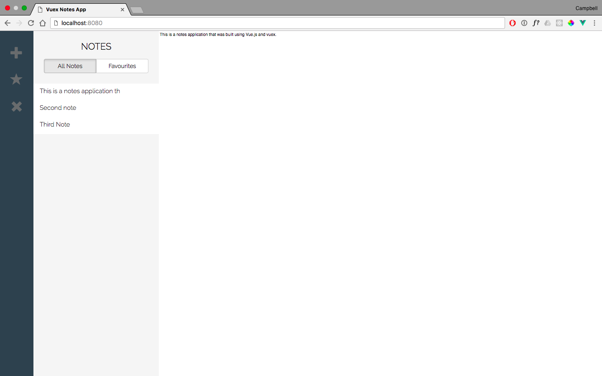

# Vue.js + Vuex Notes App

## Introduction

This application was built by following the tutorial found [here](https://coligo.io/learn-vuex-by-building-notes-app/?utm_source=ActiveCampaign&utm_medium=email&utm_content=Advanced+Beginner+Challenge%3A+JavaScript+Day+34&utm_campaign=JS+Day+34).

The app uses Vue.js for the front end connected to Vuex - a state management library for Vue.js applications.

## Notes

I had to make some changes to the Vuex interactions and I found the following resources on vuex useful:

- [Vuex Docs](https://vuex.vuejs.org/en/)
- [Vue + Vuex — Getting started by Matt Bradford](https://medium.com/@bradfmd/vue-vuex-getting-started-f78c03d9f65) 